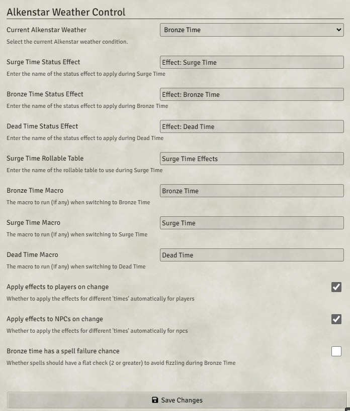
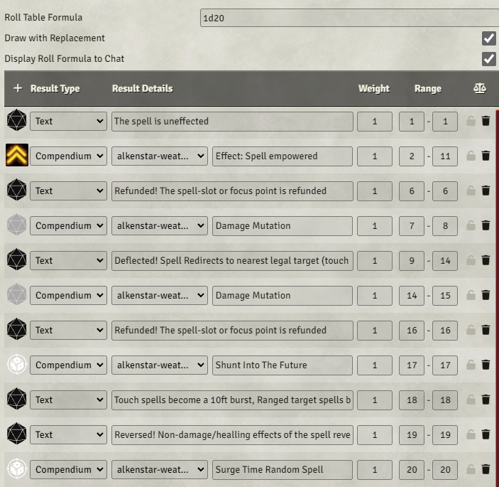
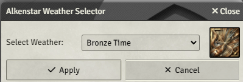

# Alkenstar Weather Control


[](https://ko-fi.com/Q5Q32OGH1)

## Overview

The **Alkenstar Weather Control** module introduces an alternate take on Mana Wastes weather mechanics into your Foundry VTT game. It automates the application of effects associated with **Surge Time**, **Bronze Time**, and **Dead Time**, providing mechanical support for the effects of the Mana Wastes for tables who want to lean into the unreliability of magic in the region.

This module offers:

- **Automatic application of weather-specific status effects** to actors when the weather changes.
- A **UI** for GMs to change the current weather condition.
- **Macros** to randomize weather conditions and interact with spellcasting mechanics.
- **Configuration hooks** to allow you to run macros for different weather conditions.
- **Integration with rollable tables** for Surge Time spell effects.
- **Customizable settings** to let you hook up custom effects for each weather setting.

## Installation

### From the Foundry VTT Module Browser

1. Open the **"Add-on Modules"** tab in the Foundry VTT **Game Settings**.
2. Click on **"Install Module"**.
3. Search for **"Alkenstar Weather Control"** in the package browser.
4. Click **"Install"** to add the module to your Foundry VTT.

### Manual Installation

1. Download the module from the [GitHub repository](https://github.com/yourusername/alkenstar-weather).
2. Place the `alkenstar-weather` folder into your `Data/modules` directory.
3. Restart Foundry VTT.

## Setup

1. **Enable the Module:**

   - In your game world, navigate to **"Manage Modules"** under the **Game Settings** tab.
   - Find **"Alkenstar Weather Control"** in the list and check the box to enable it.
   - Click **"Save Module Settings"**.

That's it! You don't need to manually import the compendium packs to use the default functionality.

## Configuration

### Module Settings

Access the module settings via **"Configure Settings"** > **"Module Settings"**:



## Understanding the Weather Conditions

This module support three weather conditions:

### **Dead Time**


**Effect:** All magic fizzles.

**Mechanics:** Spells and magical effects fail to function. This condition applies a status effect and outputs messages to chat on spellcast saying the spell fizzled.

### **Bronze Time**


**Effect:** Magic is unreliable.

**Mechanics:** Spells have a chance to fail (default 5%). This can be configured in the module settings. The module may apply a status effect indicating the spell failure chance.

### **Surge Time**


**Effect:** Magic is wild and unpredictable.

**Mechanics:** Casting a spell requires rolling on the **Surge Time Table**, which can result in various effects.

#### **Surge Time Table**

Instead of writing out the entire table, here's a visual representation:



When a spell is cast during Surge Time, the module will automatically roll on the Surge Time Table and output the corresponding status effects to chat, such as **Empowered Spell** or **Mutate Spell**, which are included in the compendium packs. Some of these are meant to be done manually, such as explosion, refunded, reversed, or deflected.

## Usage

### Changing the Weather

As the GM, you can change the current weather at any time using the weather selector on the scene toolbar.



- Click on the **Token Controls** group in the Scene Controls toolbar on the left.
- Click on the **"Select Alkenstar Weather"** tool (icon of a cloud with sun and rain).
- A dialog will appear, allowing you to select a new weather condition from a dropdown menu.
- Click **"Apply"** to change the weather.

### Randomizing the Weather

Use the **Randomize Weather Macro** to randomly select a new weather condition:

1. **Import the Macro:**

   - Go to **Compendium Packs** and open **"Alkenstar Weather Macros"**.
   - Find **"Randomize Weather"** macro.
   - Right-click and select **"Import"**.

2. **Run the Macro:**

   - Click the macro button in your macro bar to randomize the weather.

### Rolling on Spell Level Tables

During Surge Time, use the **Spell Level Table Macro** to determine spell effects:

1. **Import the Macro:**

   - Open **"Alkenstar Weather Macros"** in the Compendium Packs.
   - Find **"Surge Time Spell Effect"** macro.
   - Right-click and select **"Import"**.

2. **Run the Macro:**

   - Click the macro button.
   - Enter the spell level when prompted.
   - The macro will roll on the corresponding rollable table and display the result.

## Compendium Packs

The module includes four compendium packs:

1. **Alkenstar Weather Effects**

   - Contains predefined status effects for **Surge Time**, **Bronze Time**, and **Dead Time**.
   - Includes effects like **Empowered Spell**, **Mutate Spell**, etc.

2. **Alkenstar Weather Macros**

   - Contains macros to interact with the module's functionality.
   - Macros included:
     - **Randomize Weather**
     - **Surge Time Spell Effect**

3. **Alkenstar Weather Tables**

   - Contains the **Surge Time Effects** and the **Damage Mutation** Table used during Surge Time.
   - Defines the possible outcomes when casting spells.

4. **Random Spell Tables**

   - Contains rollable tables named **"Random Spell Rank X"** for spell ranks 0 to 10.
   - Used during Surge Time to determine random spell effects based on spell rank.

These compendiums are automatically accessed by the module when needed. You don't need to manually import them unless you wish to customize the contents.

## Customization

### Creating Macros for Weather Changes

You can create a separate macro for each weather condition to add tailored effects, messages, or game mechanics to enhance your sessions, (for example, VFX with [FX Master](https://github.com/ghost-fvtt/fxmaster)).

### Step-by-Step Guide

1. **Create Macros for Each Weather Condition:**

   - Open the **Macros Directory** in your Foundry VTT game.
   - For each weather condition, create a new macro:

     - **Dead Time Macro:**

       ```javascript
       ui.notifications.info("Dead Time begins! Magic is suppressed.");
       ```

     - **Bronze Time Macro:**

       ```javascript
       ui.notifications.info("Bronze Time begins! Magic mostly works.");
       ```

     - **Surge Time Macro:**
       ```javascript
       ui.notifications.info("Surge Time begins! Magic surges unpredictably!");
       ```

   - Save each macro with a descriptive name (e.g., **Dead Time Effects**, **Bronze Time Effects**, **Surge Time Effects**).

2. **Link Each Macro to the Corresponding Weather Condition:**

   - Open the **Module Settings** by navigating to **Game Settings** > **Configure Settings** > **Module Settings**.
   - Locate the following fields:
     - **Dead Time Macro Name**
     - **Bronze Time Macro Name**
     - **Surge Time Macro Name**
   - Enter the exact name of the macro you created for each condition.

3. **Test the Macros:**

   - Change the weather using the **Weather Selector Tool** or by running the **Randomize Weather Macro**.
   - Verify that the macros trigger FXMaster effects and display the notifications.

### Adding Custom Effects

You can create your own status effects to be applied during weather changes:

1. **Create a New Effect:**

   - Go to the **Items Directory** and create a new **Effect** item.
   - Define the effect's name, description, icon, and any mechanical changes.

2. **Update Module Settings:**

   - In the module settings, enter the exact name of your new effect in the corresponding field (e.g., **"Surge Time Status Effect Name"**).

### Modifying the Surge Time Table

To customize the Surge Time spell effects:

1. **Import the Surge Time Table:**

   - Open **"Alkenstar Weather Tables"** in the Compendium Packs.
   - Right-click on **"Surge Time Effects"** and select **"Import"**.

2. **Edit the Table:**

   - In the **Rollable Tables** directory, find the imported **Surge Time Table**.
   - Add, remove, or modify entries to suit your game's needs.

3. **Update the Module Settings (if necessary):**

   - If you renamed the table, update the **"Surge Time Rollable Table Name"** setting in the module configuration.

### Modifying the Random Spell Rank Tables

To customize the random spell effects for each spell rank:

1. **Import the Random Spell Tables:**

   - Open **"Random Spell Tables"** in the Compendium Packs.
   - Import the tables for the spell ranks you wish to modify (e.g., **"Random Spell Rank 1"**, **"Random Spell Rank 2"**, etc.).

2. **Edit the Tables:**

   - In the **Rollable Tables** directory, find the imported tables.
   - Modify the entries to reflect the random spell effects you desire.

3. **The module will now use your customized tables when rolling for that spell rank.**

## Support

If you encounter any issues or have suggestions for improvements, please visit the [GitHub repository](https://github.com/yourusername/alkenstar-weather) and open an issue.

## License

This module is distributed under the [MIT License](LICENSE).

## Acknowledgments

- **Foundry VTT Community:** For providing resources and examples that aided in the development of this module.
- **Paizo Inc.:** For the Pathfinder 2nd Edition game system and the rich lore of Alkenstar and the Mana Wastes.

---

_This module was created by Mallory Allen._
